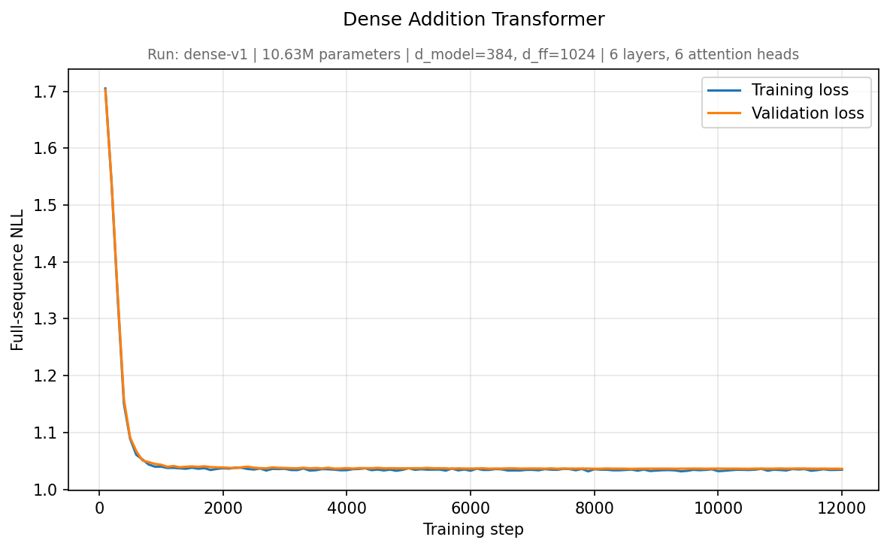
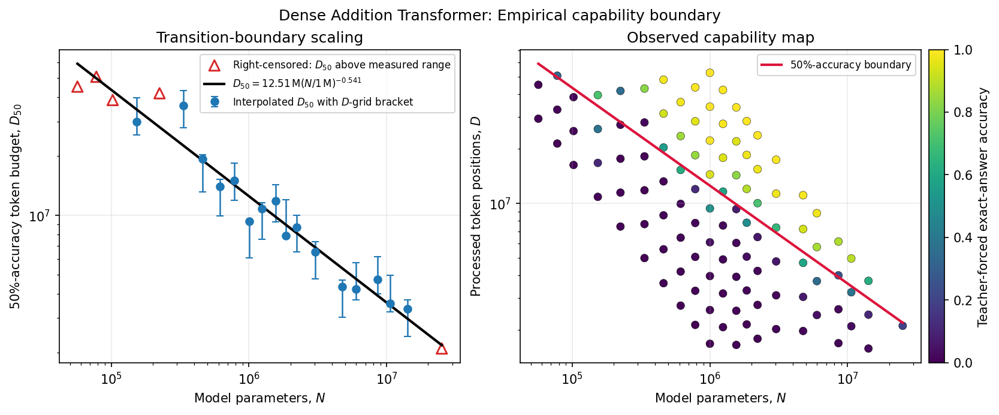
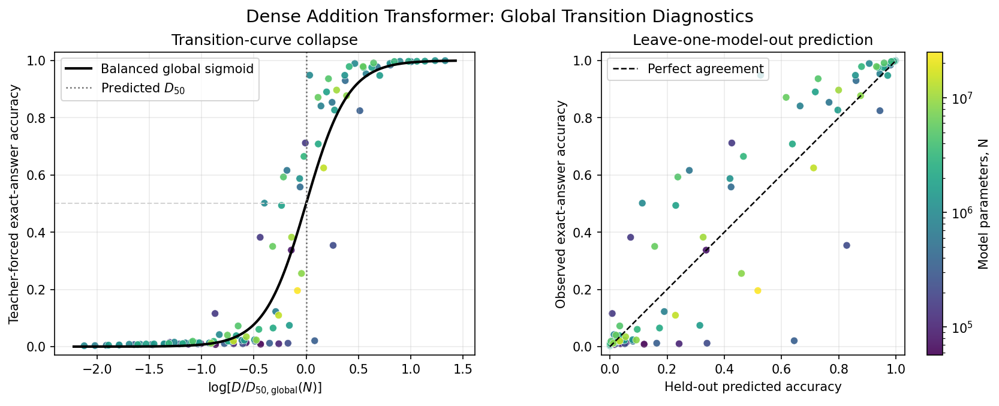

# Addition Transformers in JAX: Compute scaling and capability transitions


[](LICENSE)

Can a small Transformer learn addition as an exact algorithm, and how does that capability change with model size and training exposure? This repository develops a decoder-only Transformer in JAX/Flax and trains it on three-digit addition. It then compares models across a range of sizes and training budgets to study how model capacity affects the amount of training needed to solve the task reliably. The experiments were run in Google Colab, with checkpoints and results stored in Google Drive.


## Using the trained model

Training checkpoints and intermediate exports are generated locally under
`runs/` and are not version-controlled. The repository includes the compact
endpoint records required to reproduce Notebook 02's saved analysis. The
selected inference model is kept in a stable repository-level folder:

```text
models/addition-dense-v1/
├── params_step_12000.json
└── params_step_12000.msgpack
```

The MessagePack file contains the learned parameters. The JSON file records the matching architecture and vocabulary. The loader finds this folder relative to the repository, so ordinary use needs no model-path variable.

From the repository root, the quickest test is:

```bash
uv run addition-transformer "123+456="
```

which prints:

```text
123+456=579
```

The first command loads the weights and JIT-compiles the Transformer forward pass. Each separate `uv run addition-transformer ...` command starts a new Python process, so the in-memory model and compiled executable are not normally carried into the next command. UV reuses the installed environment, but a second invocation should not be expected to become faster because of JIT compilation.

For several queries, keep one Python process alive instead:

```bash
uv run python
```

Then load the model once:

```python
from scaling_transformers_in_jax.inference import load_addition_generator

model = load_addition_generator()

model.generate("17+25=")   # "17+25=42"
model.generate("123+456=") # "123+456=579"
model.add(123, 456)         # 579
```

The first generation compiles the required JAX computations. Later calls in the same process reuse the loaded parameters and compiled decoding path. For a one-line API, `generate_addition()` is also available and caches the loaded model within the current process:

```python
from scaling_transformers_in_jax.inference import generate_addition

generate_addition("123+456=")  # "123+456=579"
```

<details>
<summary>Colab setup after placing the repository in Google Drive</summary>

```python
from google.colab import drive

drive.mount("/content/drive")

%cd "/content/drive/MyDrive/Colab Notebooks/addition-transformers-jax"
%pip install -q --upgrade uv
```

Install the project into the active Colab Python environment before importing JAX:

```python
import sys

!uv pip install --system --python {sys.executable} -e ".[analysis]"
```

The notebook kernel can now import the package directly:

```python
import jax

from scaling_transformers_in_jax.inference import generate_addition

print("Devices:", jax.devices())
print(generate_addition("123+456="))
```

</details>

Pass `model_dir=` only to select a different export, for example `generate_addition("123+456=", model_dir="/path/to/export")`.

Some exact generations from the trained model are:

```text
2+3=5
17+25=42
123+456=579
```

In the decoding comparison in Notebook 01, greedy, temperature, top-k, top-p, and combined top-k/top-p decoding all produced `123+23=146` for the valid prompt `123+23=`. The notebook also probes inputs outside the training grammar; one recorded set of greedy continuations was:

```text
+++       -> +++11=11
12+1      -> 12+191=203
100++20=  -> 100++20=120
```

These malformed-prompt completions are sequence continuations, not reliable arithmetic predictions. `generate_addition()` and `model.generate()` deliberately allow this kind of exploration: a prompt may use any characters in the model vocabulary and may occupy up to the 12-token context window. `model.add(a, b)` remains the strict arithmetic interface and accepts only integer operands from 0 to 999.

## Code organization

The reusable implementation lives in `src/scaling_transformers_in_jax/`:

- `addition_data.py` constructs and encodes the addition dataset.
- `transformer.py` defines the decoder-only Transformer.
- `training.py` and `checkpointing.py` handle optimization and resumable runs.
- `evaluation.py`, `exporting.py`, `generation.py`, and `inference.py` provide metrics, portable parameter exports, cached decoding, and the small pretrained-model interface.
- `cli.py` exposes that inference interface as the `addition-transformer` terminal command.
- `scaling_experiments.py` and `scaling_laws.py` support the multi-model experiment and its fits.

The repository is named `addition-transformers-jax`; the Python import package
remains `scaling_transformers_in_jax` for compatibility with the notebooks and
source modules.

## Notebooks

### 1. [`01_addition_transformer.ipynb`](notebooks/01_addition_transformer.ipynb)

[](https://colab.research.google.com/github/shoaibphysics/addition-transformers-jax/blob/main/notebooks/01_addition_transformer.ipynb)

A clean end-to-end experiment that trains a roughly 10-million-parameter model, follows its learning curves, evaluates held-out additions, exports and reloads the learned parameters, and compares several decoding strategies.

The model reaches 100% teacher-forced exact-answer accuracy, with answer-only NLL of approximately $3\times10^{-6}$.



$E_{\mathrm{full}}\approx1.03$ is nonzero because full-sequence NLL scores the randomly sampled operand characters as well as the deterministic answer. The observed full-sequence NLL of 1.0347 is close to this analytic floor.

### 2. [`02_dense_addition_scaling_and_transitions.ipynb`](notebooks/02_dense_addition_scaling_and_transitions.ipynb)

[](https://colab.research.google.com/github/shoaibphysics/addition-transformers-jax/blob/main/notebooks/02_dense_addition_scaling_and_transitions.ipynb)

This notebook trains 110 endpoints across 21 model configurations and nine
approximate compute budgets. Following
[Hoffmann et al. (2022), *Training Compute-Optimal Large Language Models*](https://arxiv.org/abs/2203.15556),
it first examines IsoFLOP profiles (Approach 2) and then fits the parametric
loss surface directly (Approach 3). On this task, neither analysis identifies
a stable compute-optimal frontier: the IsoFLOP profiles do not form consistent
smooth valleys, while the direct fit is sensitive to the assumed irreducible loss floor.

A clearer relationship appears in the training exposure needed to acquire addition:

$$
D_{50}(N) \approx 14\,\mathrm{M}
\left(\frac{N}{1\,\mathrm{M}}\right)^{-0.56}.
$$

Here, $D_{50}$ is the number of processed token positions required to reach 50% teacher-forced exact-answer accuracy. Within this model family, doubling the parameter count reduces the required training exposure by roughly 32%, although total transition compute still increases.



After rescaling each endpoint by its fitted $D_{50}(N)$, the measurements approximately collapse onto a shared sigmoid. The leave-one-model-out panel shows where this description generalizes and where the transition remains noisy.



## Running the notebooks

### Google Colab

Use the **Open in Colab** badges above. By default, each notebook clones the
repository into the temporary Colab runtime. Notebook 02 reads the committed
endpoint records directly, so keep `RUN_TRAINING = False` when reproducing the
saved analysis.

Set `USE_GOOGLE_DRIVE = True` only when running new training whose checkpoints
should survive a runtime reset. The notebook will then mount Google Drive and
use the project directory under `MyDrive/Colab Notebooks/`.

### Local execution

Install [uv](https://docs.astral.sh/uv/getting-started/installation/), download
or clone the complete repository, and run these commands from its root:

```bash
uv sync --locked --extra analysis
uv run --with jupyter jupyter lab
```

The notebooks locate the repository automatically. Their setup cells do not
need to be skipped or edited. The full 110-run experiment is substantially
faster on an accelerator; local CPU execution is better suited to inference,
inspection, and reproducing the saved analysis.

## Future work

Future work will compare dense and mixture-of-experts architectures, implement grouped expert computation, and investigate fused MoE kernels using
JAX Pallas.

## AI-use disclosure

The Transformer architecture and core modeling and training modules were
designed and implemented by the author. AI tools were used selectively for
prose editing, code review, plotting support, and refinements to parts of the
training and analysis workflow.

The repository packaging and user-facing inference workflow, exported model loading helper, and
command-line interface were generated with AI assistance. The author reviewed
and tested all retained code and verified the complete installation and
inference pipeline.
